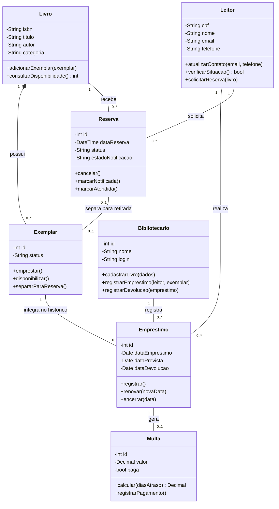
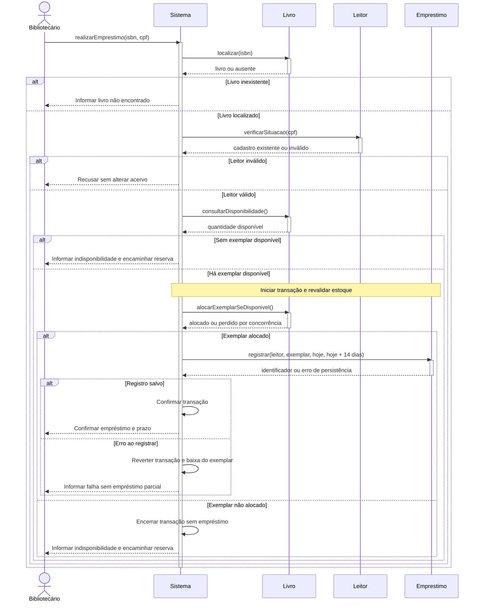
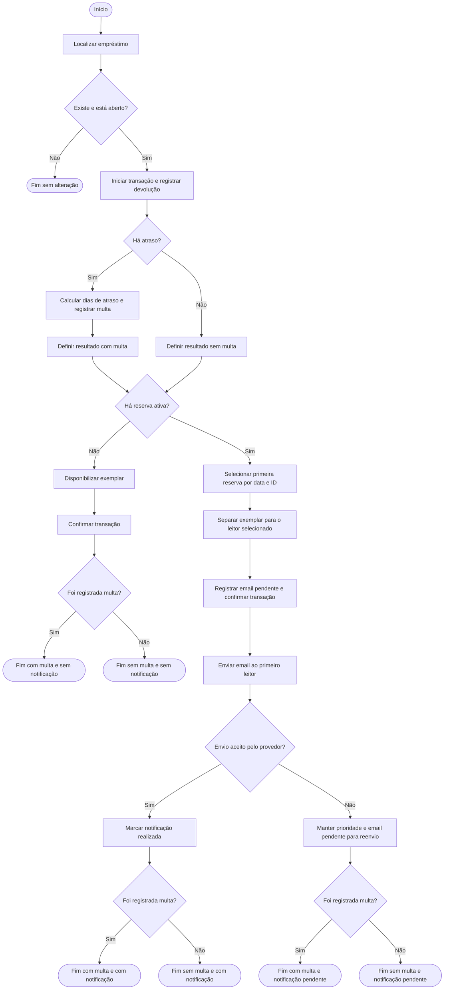

# BiblioTech - Modelagem UML

**Responsável:** Richard Brandão

Os três diagramas representam o produto completo da descrição. O código da Questão 3 preserva o recorte do gerenciador original. O SQLite fornecido registra quantidade disponível por livro e não possui tabelas de exemplares individuais ou bibliotecários. Implementar todo este modelo demandaria uma migração, que não foi feita na refatoração.

## 1 Diagrama de classes

### Interpretação das cardinalidades e invariantes

- Um livro pode existir no catálogo sem exemplares e possuir vários exemplares; cada exemplar pertence a um único livro.
- Cada empréstimo vincula exatamente um leitor, um exemplar e um bibliotecário responsável. Um exemplar participa de vários empréstimos ao longo do tempo, mas de **no máximo um em aberto** em cada instante. A cardinalidade histórica `0..*` não autoriza empréstimos simultâneos.
- Cada reserva pertence a um leitor e a um livro, não a um exemplar específico na solicitação. Após uma devolução, poderá ter um exemplar separado; as duas extremidades opcionais indicam que nem toda reserva já recebeu exemplar e nem todo exemplar está separado.
- Um empréstimo gera zero ou uma apuração de multa. Pagamentos e eventual parcelamento não foram modelados.
- `dataDevolucao` é opcional enquanto o empréstimo está aberto. Status propostos para exemplar: DISPONIVEL, EMPRESTADO e SEPARADO; para reserva: ATIVA, NOTIFICADA, ATENDIDA ou CANCELADA. ATIVA e NOTIFICADA continuam bloqueando renovação.
- `verificarSituacao()` nesta versão verifica cadastro existente. Não há bloqueio por multa presumido. Métodos nas entidades expressam responsabilidades conceituais; persistência, transporte de email e PDF pertencem a serviços na implementação.

## 2 Diagrama de sequência - Realizar empréstimo

As ativações estão balanceadas. O fluxo distingue livro inexistente, leitor inválido e indisponibilidade. A revalidação evita vender a mesma disponibilidade duas vezes. No código refatorado, a consulta e a baixa condicional ocorrem dentro de `BEGIN IMMEDIATE`; a reserva é criada automaticamente quando não há estoque, preservando o original. A confirmação de email e o comprovante são efeitos posteriores à transação e foram omitidos do desenho para manter os cinco participantes exigidos.

## 3 Diagrama de atividades - Devolver livro e processar reservas

Mermaid não possui um tipo clássico de diagrama de atividades UML equivalente ao de classes. O fluxo é representado por `flowchart TD`, com início/fins, ações e decisões, mantendo a semântica de atividades solicitada.

“Notificação” nos estados finais significa **email de disponibilidade para o próximo leitor da reserva**. Um aviso de multa é um evento separado. O desenho cobre os quatro resultados de sucesso e a falha de email sem desfazer a devolução. Aceite pelo provedor não garante leitura da mensagem pelo destinatário. Falha de persistência antes da confirmação reverte a transação; essa regra vale para ambos os ramos. A fila persistente de notificações e a separação de exemplar são propostas para o produto completo e não constam do esquema SQLite legado.

## Referências de sintaxe

- [Mermaid - Class diagrams](https://mermaid.js.org/syntax/classDiagram.html)
- [Mermaid - Sequence diagrams](https://mermaid.js.org/syntax/sequenceDiagram.html)
- [Mermaid - Flowcharts](https://mermaid.js.org/syntax/flowchart.html)
